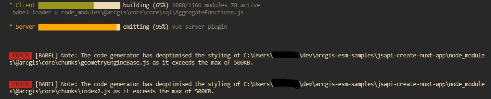

# Server Side Rendering Frameworks with @arcgis/core

I am elated by the beta release of the [@arcgis/core](https://www.npmjs.com/package/@arcgis/core) ECMAScript Modules (ESM). The release is a major victory in the [campaign to modernize](https://www.youtube.com/watch?v=woTI3jB5Z2Q&feature=youtu.be&t=182) the ArcGIS API for JavaScript (JSAPI). Needless to say, I spent hours pouring over the ESM samples provided via the [jsapi-resources](https://github.com/Esri/jsapi-resources/tree/master/esm-samples) Github repo. I then set out on the task of creating my own samples using Server Side Rendering (SSR) frameworks.

If you are here for examples, take a look at the [Github repo](https://github.com/benelan/arcgis-esm-samples).

## The First Attempt

If you tried this on your own, you likely ran into the following error message:

```
Error [ERR_REQUIRE_ESM]: Must use import to load ES Module: ...
require() of ES modules is not supported.
... is an ES module file as it is a .js file whose nearest parent package.json contains "type": "module" which defines all .js files in that package scope as ES modules.
Instead rename FeatureLayer.js to end in .cjs, change the requiring code to use import(), or remove "type": "module" from ...
```

ECMAScript modules on NodeJS are still [relatively new](https://nodejs.medium.com/announcing-core-node-js-support-for-ecmascript-modules-c5d6dc29b663). Therefore, ESMs are not currently supported on the server for [NextJS](https://nextjs.org/) nor [NuxtJS](https://nuxtjs.org/) (two of the most popular SSR frameworks for React and Vue respectively). The SSR Frameworks use CommonJS modules instead, which, to keep the package a reasonable size, are not included in @arcgis/core.

As suggested in the error message, I started changing file extensions to cjs (CommonJS) or mjs (ECMAScript). However, it quickly diverged into a game of whack-a-mole. I came across another solution for using ES modules in SSR Frameworks: transpiling the dependencies with babel.

NuxtJS has a built in method for transpiling dependencies, [documented here](https://nuxtjs.org/docs/2.x/configuration-glossary/configuration-build#transpile). Transpiling @arcgis/core will take several minutes on the first build, so have patience! You will also see a few errors (below) concerning file size.



Once @arcgis/core is transpiled, you will be able to import the JSAPI ES modules. That should solve the issue if your application does not render a map. I included an example of a no-map solution using module transpilation in the [nuxt sample](https://github.com/benelan/arcgis-esm-samples/tree/main/jsapi-create-nuxt-app#non-map-workflows).


However, most of us like maps in our apps. And this is where we run into the second error message:

```
ReferenceError: Element is not defined
```

This error is referring to a Document Object Model (DOM) [Element](https://developer.mozilla.org/en-US/docs/Web/API/Element). The DOM exists in the browser, and is therefore unavailable to code executed on the server by Node. Rendering an ArcGIS JSAPI map on the server may not work, but there are always other options. I scrapped the module transpilation workflow and moved on.

## Forgoing SSR for the ArcGIS Component

The final solution for getting @argis/core working on a SSR framework is disabling server side rendering for the map component. I know, I know, that sounds like cheating right? It's actually a viable option. The rest of your application will still reap the benefits of SSR. How much SEO information lives in the map component anyway?

Many SSR Frameworks provide the option, with varying degrees of difficulty, to only render a component on the client side. This is what we need. Of the options I explored, NextJS has the [clearest workflow](https://nextjs.org/docs/advanced-features/dynamic-import#with-no-ssr). Here is the code for using a component without SSR in NextJS:

```js
import dynamic from "next/dynamic";

const EsriMapWithNoSSR = dynamic(() => import("../components/EsriMap"), {
  ssr: false,
});
```

That's it. Now you can use the EsriMapWithNoSSR component and the map will render!


 I found solutions for NuxtJS and Sapper as well, which are included in the [Github repo](https://github.com/benelan/arcgis-esm-samples). The samples contain additional framework specific information.
